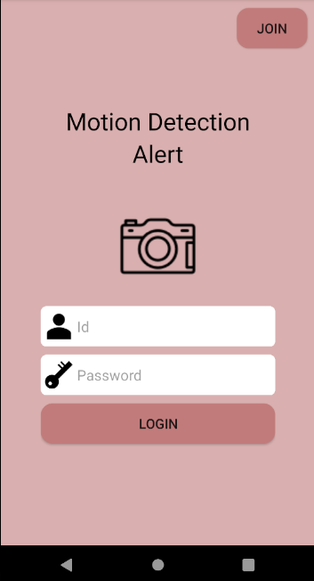
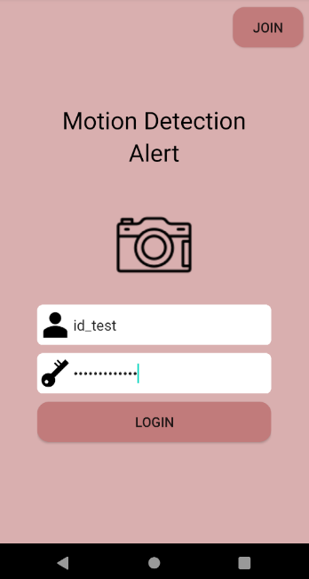
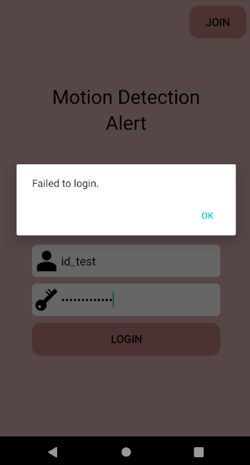
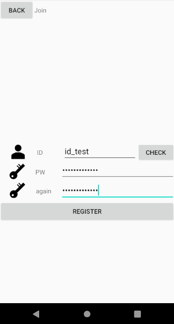
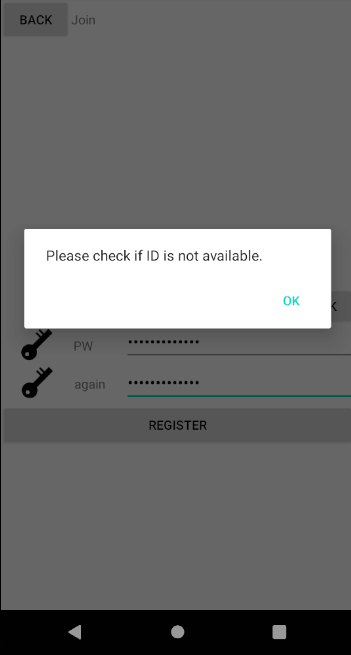
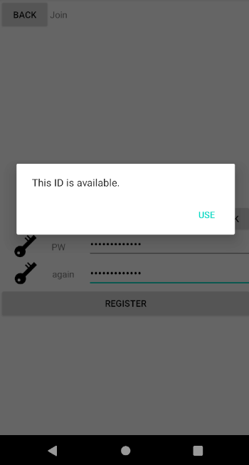
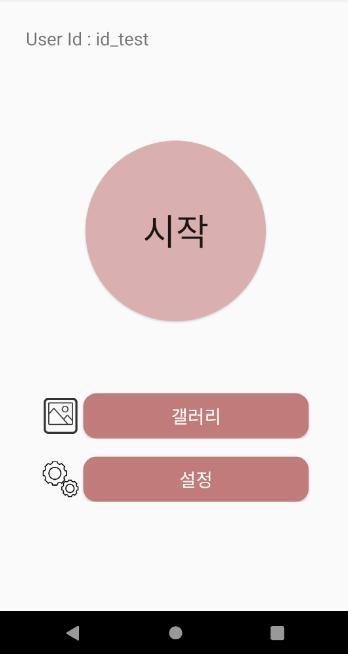
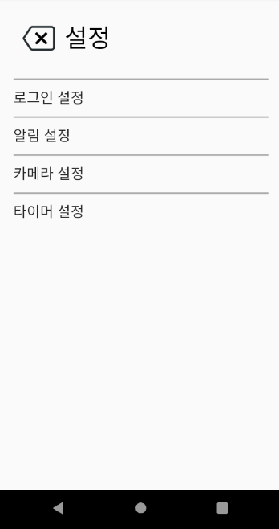
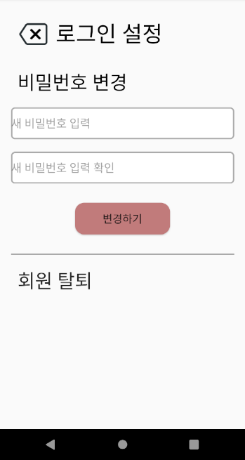
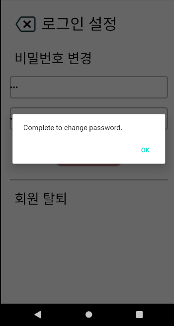

# Additional Explain for Admin Branch

## 실행 전 안내 사항

- 앱을 실행하기 전에, 터미널 환경에서 AppServer 폴더로 이동하여 flask run --host=your_ip_address 명령어를 통해 서버를 실행시켜야 합니다.
- 그 후, Appclient의 MainActivity, LoginSettingActivity, RegisterActivity의 String url = "http:~" 를 찾아 SERVER_IP 부분을 모두 your_ip_address로 변경해야 합니다.
- Appclient의 파일 전체를 실행시키면 main 화면부터 앱이 동작합니다.

## 구현된 기능

- 아이디와 비밀번호를 이용하여 로그인 할 수 있습니다.
- 아이디와 비밀번호를 입력하여 회원가입 할 수 있습니다. 이때, 아이디는 기존에 가입되어 있는 아이디와 일치하지 않아야 하며, 이를 위해 아이디 중복 체크를 반드시 실행해야 합니다.
- 잘못된 방식의 로그인을 10번 이상 시행할 경우 강제로 화면이 전환되며, 3600초 (1시간) 동안 그 어떠한 행위도 할 수 없습니다.
- 로그인에 성공 했을 경우 home 화면으로 이동하며, 모니터링 시작 버튼과 갤러리 설정 버튼은 동작하지 않고, 설정 버튼만 동작합니다.
- 설정 버튼을 누를 경우 login setting 화면으로 이동하며, 로그인 설정 버튼을 눌러 비밀번호를 변경하거나 회원 탈퇴를 할 수 있습니다.
- 비밀번호를 변경한 경우 초기 main 화면으로 돌아가 다시 로그인을 진행합니다.

## demo screenshot

