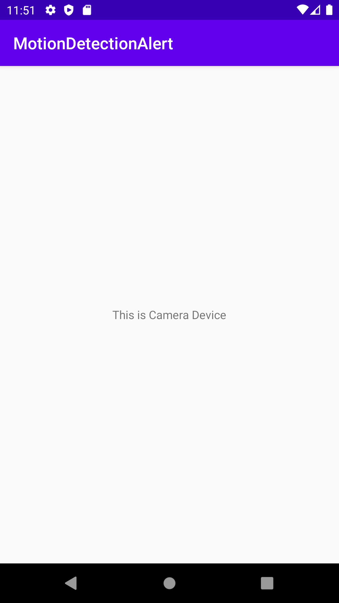
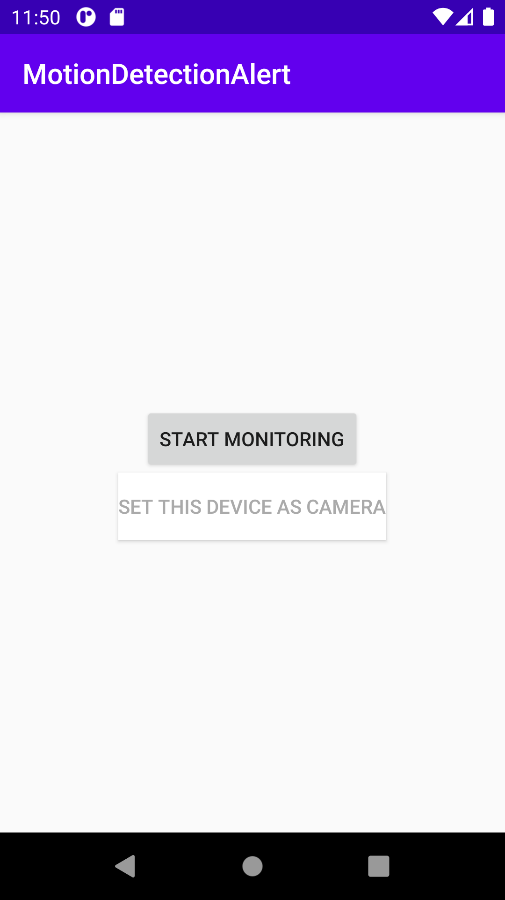
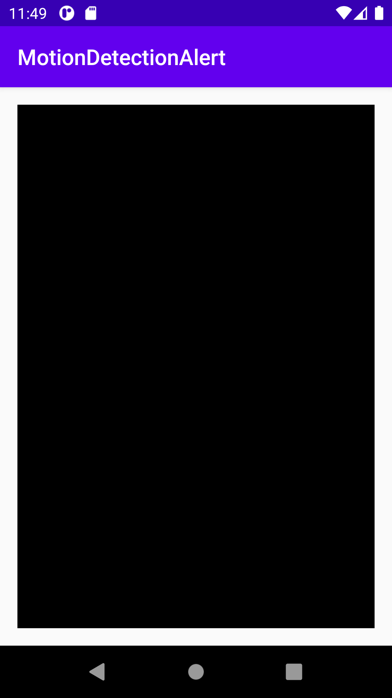
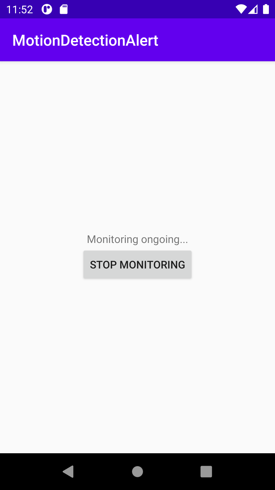

# Additional Explain for Detection Branch

## 실행 전 안내 사항

- socket_app.py 소켓 2개를 포트 9999, 9998에 두고 실행
- 안드로이드 시작 인텐트는 StartMonitoringActivity이다. 에뮬레이터를 두개 띄운 후 한대를 카메라용 기기로 두고 실행해야 함

## 구현된 기능

- 서버에서 소켓을 통해 클라이언트 조작
- 모션 감지시 Retrofit을 이용하여 서버로 사진 전송, 서버는 전송 받은 사진을 파이어베이스에 저장.

## 프로그램 구조

- 클라이언트와 서버 사이에 함수 전달 목적으로는 소켓을 사용
- 사진 데이터는 Retrofit을 이용하여 서버로 전달한 후 DB에 저장

## 실행화면

- 카메라로 사용할 기기와 사용자가 원격으로 사용할 기기 각각의 시작화면  
  
  
- 소켓을 통해 모니터링 시작 명령을 받으면 각각 화면이 바뀜  
  
  
- 카메라 화면에서 움직임이 감지되면 사진이 서버를 거쳐 DB에 저장된다.
