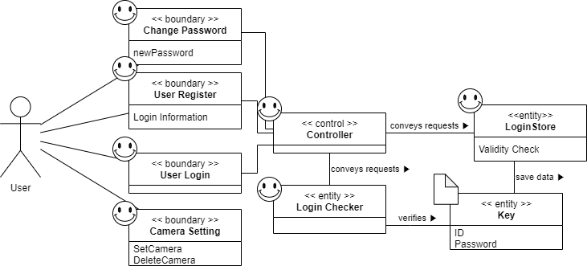
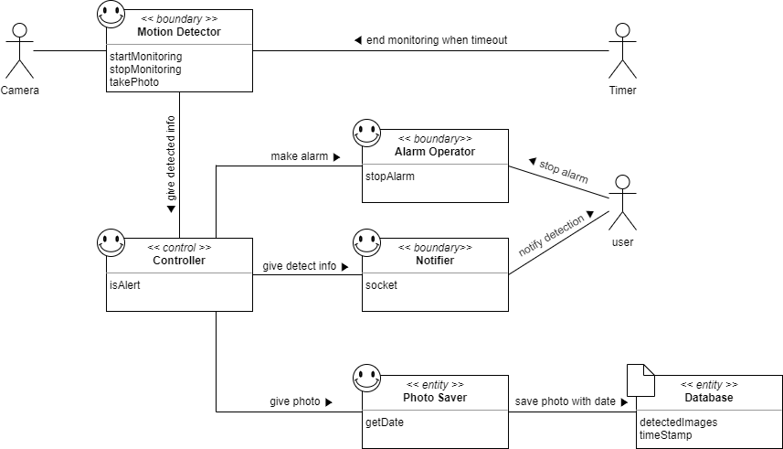
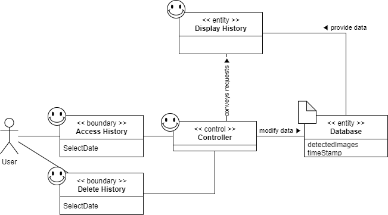

# Domain Analysis

### Concept Definitions
Domain Model for Admin 

Domain Model for Monitoring 

Domain Model for Access History 

Responsibility Description | Type | Concept Name
---------------------------|:----:|:-----------:
전반적인 모든 concept들의 행동을 제어하고 다른 concept들에게 행동을 위임한다.| D | Controller
사용자가 명시적으로 모니터링 시작과 중지할 수 있도록 한다. 일정시간이 지나면 모니터링을 중지하도록 한다. 움직임이 감지되면 사진을 촬영한다. | D | Motion Detector
움직임이 감지돼서 경보 상태에 진입하게 되면 카메라 기기에서 알람을 울린다. 경보 알림 팝업을 통해 사용자는 경보를 해제할 수 있도록 한다. | D | Alarm Operator
움직임이 감지되면 촬영된 사진을 날짜와 함께 Database/repository에 저장한다. | D | Photo Saver
움직임이 감지돼서 경보 상태에 진입하게 되면 사용자 기기에게 알림을 전송한다. | D | Notifier
사용자의 로그인 정보에 따른 카메라 등록 정보, 설정 값, 갤러리를 저장. | K | Database
회원가입을 통해 사용자를 새로 등록한다. | D | User Register
사용자가 설정한 ID 및 Password 정보. | K | Key
사용자가 ID와 Password를 입력해 로그인할 수 있게 한다. | D | User Login
로그인을 위한 ID 및 Password 정보를 저장한다. 저장하기 전에 ID 및 Password가 지정된 형식에 맞는지 검사한다. | D | Login Store
사용자가 로그인할 때, ID 및 Password 정보가 일치하는 지 확인한다. | D | Login Checker
사용자가 비밀번호를 변경할 수 있도록 한다. 현재 비밀번호를 다시 입력받아 확인하고 새로운 비밀번호를 설정한다. | D | Change Password
모니터링할 카메라를 설정하거나 삭제한다. | D | CameraSetting
모니터링 기록에 접근한다. | D | Access History
사용자가 접근하고자 하는 기록을 보여준다. | D | Display History
특정 날짜의 모니터링 기록을 삭제한다. | D | Delete History

### Association Definitions
Concept Pair | Association Description | Association Name
:-----------:|-------------------------|:---------------:
Motion Detector ↔ Controller | Motion Detector는 움직임을 감지하면 Controller로 촬영한 사진을 보낸다. | give detected info
Controller ↔ Alarm Operator | Controller는 경보 상태가 되면 Alarm Operator에게 알람을 울리라고 지시한다. | make alarm
Controller ↔ Notifier | Controller는 경보 상태가 되면 Notifier에게 감지 정보를 전달하고 사용자에게 알림을 전송하도록 지시한다. | give detect info
Controller ↔ Photo Saver | Controller는 경보 상태가 되면 Photo Saver에게 촬영한 사진을 전달하고 Database에 저장하도록 지시한다. | give photo
Photo Saver ↔ Database | Photo Saver는 현재 날짜 및 시각을 구해서 촬영된 사진과 함께 Database에 저장한다. | save photo with date
Controller ↔ Login Store | Controller는 로그인 정보가 저장되어야 할 때 Login Store로 로그인 정보를 저장하도록 지시한다. | conveys requests
Controller ↔ Login Check | Controller는 로그인 정보를 확인하려고 할 때 Login Check로 로그인 정보가 일치하는지 확인하도록 지시한다. | conveys requests
Login Check ↔ Key | Key의 ID와 Password 값과 Login Check가 확인하려는 정보가 일치하는 지 확인한다. | verifies
Login Store ↔ Key | Key에 Login Store가 저장하려는 로그인 정보를 저장한다. | save data
Controller ↔ Display History | Controller는 Display History가 모니터링 기록을 보여주도록 지시한다. | conveys requests
Display History ↔ Database | DataBase는 Display History에게 특정한 날짜의 데이터를 제공한다. | provide data
Delete History ↔ Database | Delete History는 Database에 있는 특정한 날짜의 데이터를 삭제한다. | modify data

### Attribute Definitions
<table>
  <tr>
    <th>Concept</th>
    <th>Attributes</th>
    <th>Attribute Description</th>
  <tr>
    <td rowspan="3">Motion Detector</td>
    <td>startMonitoring</td>
    <td>모니터링을 시작</td>
  </tr>
  <tr>
    <td>stopMonitoring</td>
    <td>모니터링을 중지</td>
  </tr>
  <tr>
    <td>takePhoto</td>
    <td>움직임이 감지되었을 때 사진을 촬영함</td>
  </tr>
  <tr>
    <td>Controller</td>
    <td>isAlert</td>
    <td>현재 상태가 경보 상태인지 아닌지를 저장함</td>
  </tr>
  <tr>
    <td>Alarm Operator</td>
    <td>stopAlarm</td>
    <td>(사용자에게 도착한 알림 팝업을 통해)카메라 기기의 알람을 종료</td>
  </tr>
  <tr>
    <td>Notifier</td>
    <td>socket</td>
    <td>경보 상태일 때 사용자 기기로 알림을 전송하도록 하는 소켓</td>
  </tr>
  <tr>
    <td>Photo Saver</td>
    <td>getDate</td>
    <td>사진을 저장하기 위해 현재 날짜 및 시간을 구함</td>
  </tr>
  <tr>
    <td rowspan="2">Database</td>
    <td>detectedImages</td>
    <td>움직임이 감지됐을 당시에 촬영된 사진</td>
  </tr>
  <tr>
    <td>timeStamp</td>
    <td>움직임이 감지됐을 당시에 기록된 날짜 및 시간</td>
  </tr>
  <tr>
    <td>User Register</td>
    <td>Login Information</td>
    <td>회원가입 시 입력하는 로그인 정보</td>
  </tr>
  <tr>
    <td rowspan="2">Key</td>
    <td>ID</td>
    <td>사용자를 식별하는 ID</td>
  </tr>
  <tr>
    <td>Password</td>
    <td>해당 사용자임을 인증하는 비밀번호</td>
  </tr>
  <tr>
    <td rowspan="2">CameraSetting</td>
    <td>SetCamera</td>
    <td>기기를 모니터링 카메라로 설정한다.</td>
  </tr>
  <tr>
    <td>DeleteCamera</td>
    <td>모니터링 카메라로 설정한 기기를 삭제한다.</td>
  </tr>
  <tr>
    <td>Login Store</td>
    <td>Validity Check</td>
    <td>로그인 정보를 저장하기 전 실시하는 유효성 검사</td>
  </tr>
  <tr>
    <td>Change Password</td>
    <td>newPassword</td>
    <td>새로 변경하는 비밀번호</td>
  </tr>
  <tr>
    <td>Access History</td>
    <td>SlectDate</td>
    <td>접근하려고 하는 기록의 날짜</td>
  </tr>
  <tr>
    <td>Delete History</td>
    <td>SelectDate</td>
    <td>삭제하려고 하는 기록의 날짜</td>
  </tr>
</table>

