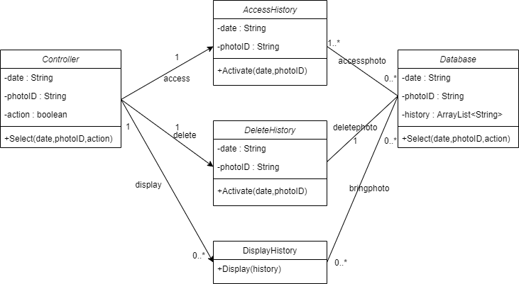
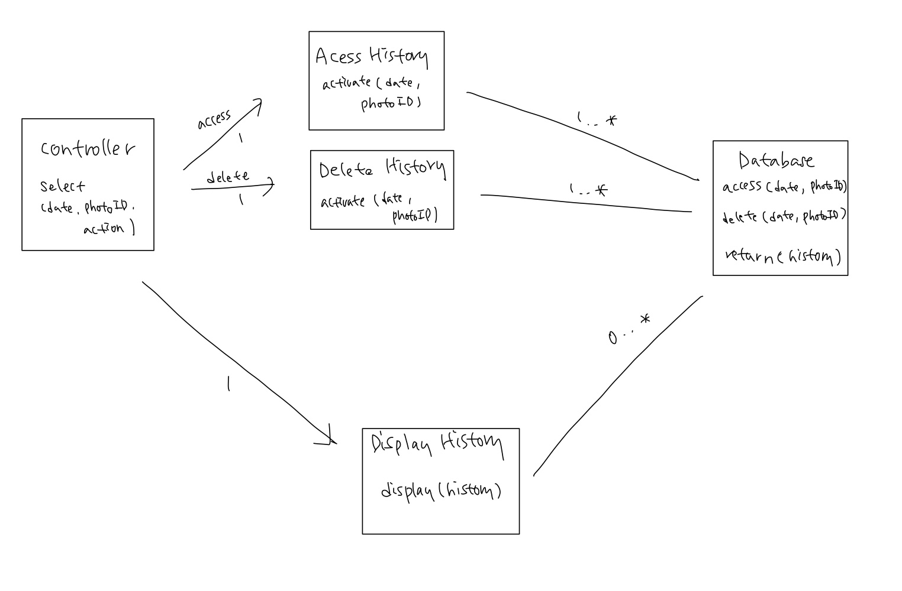

# History

## Class Diagram

UC-8 class diagram

 

 

sequence diagram trials

 

 

## Object Sequence Diagram

UC-8 sequence diagram

 

 

sequence diagram trials

 
첫번째 설계는 Database가 Display History를 직접 call하는 설계이며 두번째 설계는 Database가 결과로 나온 history 데이터를 Controller에게 return 한 뒤 Controller가 Display History를 call하는 방식이다.
  
Database가 Display History를 call하는 것은 Database의 기능에 맞지 않다고 판단하여 두번째 설계로 결정하였다.
  

