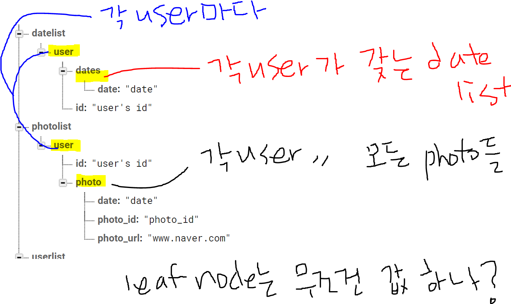

# History Subgroup Log

## Product Backlog

| Backlog item                                                           | Estimate |
| ---------------------------------------------------------------------- | -------- |
| 사용자로서, 나는 모니터링 기록에 접근하고 삭제할 수 있다.                | 2        |

## 1st Sprint (5.27~30)

- 사용자로서, 나는 모니터링 기록에 접근하고 삭제할 수 있다. 

### Sprint Goal

사용자가 날짜별로 모니터링 기록에 접근하고 기록을 삭제할 수 있도록 하는 기능 구현

### Sprint Backlog

| Tasks                                                                    | Thu | Fri | Sat | Sun |
| ------------------------------------------------------------------------ | --- | --- | --- | --- |
| 서버 및 클라이언트의 기록 접근 관련 함수 인터페이스 구축                   | 1  |     |     |     |
| DB 함수 인터페이스 구축                                                   |  1 |    |     |     |
| 기록 접근 시 서버에서 관련 기록 DB 처리 기능                              |    |   2  |     |     |
| 기록 삭제 시 서버에서 관련 기록 DB 삭제처리 기능                          |    |   2  |     |     |
| 서버와 클라이언트 간 데이터 전송                                          |    |     | 3    |     |
| 클라이언트에서 탐지 기록 날짜별 나열 기능, 사진 나열 기능 구현             |    |     |  3   |     |
| 클라이언트에서 사진 자세히 보기와 삭제 기능 구현                           |    |     |  2   |     |
| 클라이언트 UI 구축                                                        |    |     |     |  2   |

## Daily Scrum

1. 어젠 뭘 하셨나요?
2. 오늘은 뭘 하실건가요?
3. is anything in your way?

### 2021-05-27 Thu

혜연

1. 안했음
2. 서버 측 함수 인터페이스 구축
3. 서버와 데이터베이스 연결이 어렵다

유경

1. git 연동에 대한 검색과 시도?
2. 클라이언트 측 함수 인터페이스 구축
   : Gallery, ViewPhoto, GalleryDate, GalleryPhotoList class와 layout 생성, 필요한 함수
3. Gallery class를 controller로 두면 되는 걸까? 에 대한 고민..

### 2021-05-28 Fri

혜연

1. 서버 함수 인터페이스 구축
2. db 데이터구조 및 서버에서 db 데이터 불러오기 및 삭제
3. 이미지는 어떻게 처리하나?

유경

1. 클라이언트 함수 인터페이스 구축
2. 클라이언트 : gallery를 시작화면으로 설정, back button과 datelist를 위한  recyclerview 생성, db data 구조 정리?
3. flask와 nosql의 길은 멀고도 험하다? 
   
   맞게 이해한 건지 잘 모르겠다 :(
   
### 2021-05-29 Sat

혜연

1. db 데이터 구조를 짜고 서버에서 db 데이터 불러오기
2. 클라이언트 갤러리 기능 중 날짜 누르면 사진이 뜨는 기능 구현
3. 페이지 전환시 데이터를 주고 받는 방법을 고민해봐야겠다

유경

1. 클라이언트 구현 준비
2. date 누르면  photolist 구현 / firebase에 data 추가해보기
3. date 누르면 밑에 사진이 주르륵 뜨는 것은 방법 검색.. 일단은 새 화면 띄우기로 진행한 부분이 아쉽다
   realtimedatabase 구조가 이해가 간 듯 하다(?)
   
### 2021-05-30 Sun

혜연

1. 갤러리의 날짜 띄우기 (데이터 받는 부분 제외) / 서버 코드 보완
2. 클라이언트가 서버로부터 데이터 받기 / 갤러리 날짜 띄우기 완성
3. 클라이언트와 서버가 통신하는 부분이 가장 어려웠다

유경

1. pohtolist, gridview 구현
2. firebase-flask-android 값 받아오기, 받아온 jsonarraylist string array로 변환 후 parsing, glide 사용하여 gridview에 url 이미지로 띄우기
3. 거북이가 틀림없다... 12시간 넘게 해도 아직 완벽하게 못하다니 :(
3. key 없는 jsonarray 값을 제대로 받아오는 게 어려웠다. jsonobject와 jsonarray 사이에서 엄청나게 헤맸다.
3. glide라는 라이브러리를 알게 되었다. 유익한 라이브러리 같다.
