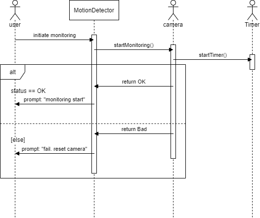
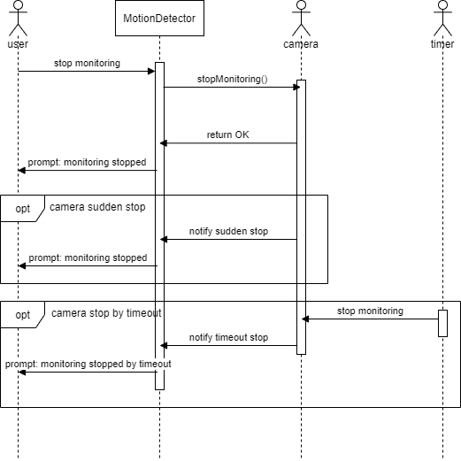

# Motion Detection

## Class diagrams

UC-5 class diagram

 

UC-6 class diagram

 

UC-7 class diagram

 

## Sequence diagrams

UC-5 class diagram

 

UC-5 class diagram

 

UC-5 class diagram

 

