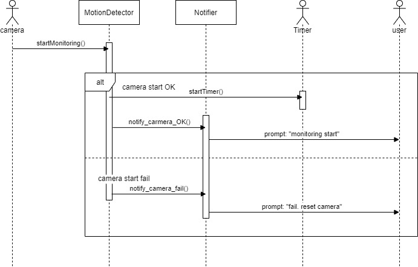
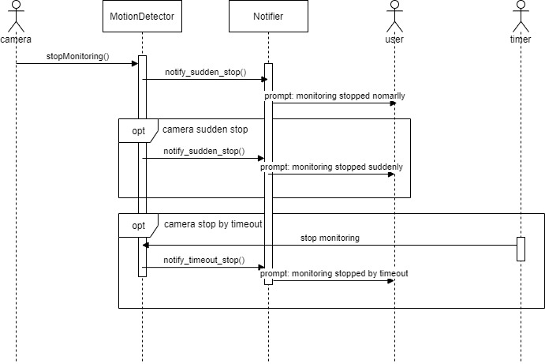
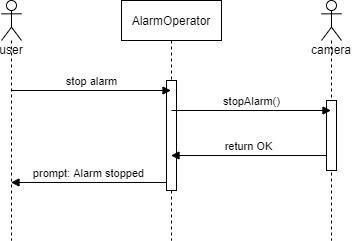

# Motion Detection

## Class diagrams

UC-5 StartMonitoring class diagram

 

UC-6 StopMonitoring class diagram

 

UC-7 StopAlarm class diagram

 

UC-9 DetectMotion class diagram

 

UC-10 TakePhoto class diagram

 

UC-11 SendAlert class diagram

 

## Sequence diagrams

UC-5 StartMonitoring sequence diagram

 

UC-6 StopMonitoring sequence diagram

 

UC-7 StopAlarm sequence diagram

 

UC-9 DetectMotion sequence diagram

 

UC-10 TakePhoto sequence diagram

 

UC-11 SendAlert sequence diagram

 

