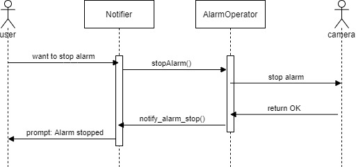

# Motion Detection

## Class diagrams

UC-5 StartMonitoring & UC-6 StopMonitoring class diagram

 

UC-7 StopAlarm class diagram

 

UC-9 DetectMotion class diagram

 

UC-10 TakePhoto class diagram

 

UC-11 SendAlert class diagram

 

## Sequence diagrams

UC-5 StartMonitoring sequence diagram

 

UC-6 StopMonitoring sequence diagram

 

UC-7 StopAlarm sequence diagram

 

UC-9 DetectMotion sequence diagram

 

UC-10 TakePhoto sequence diagram

 

UC-11 SendAlert sequence diagram

 

sequence diagram trials

 

이전 커밋의 UC-5 sequence diagram. MotionDetector가 camera를 시작하는 동시에 user에게 카메라의 시작을 알려주기도 했으나 MotionDetector는 user에게 알려주는 기능까지 할 필요없다고 판단, 높아지는 coupling을 감수하고 더 나은 cohesion을 얻도록 수정된 diagram에서는 Notifier에게 알려주는 기능을 위임함.

이전 커밋의 UC-6 sequence diagram. UC-5와 마찬가지로 MotionDetector에서 카메라를 종료하면 user에게 알려주는 기능을 Notifier에게 위임하도록 수정함.

이전 커밋의 UC-7 sequence diagram.

