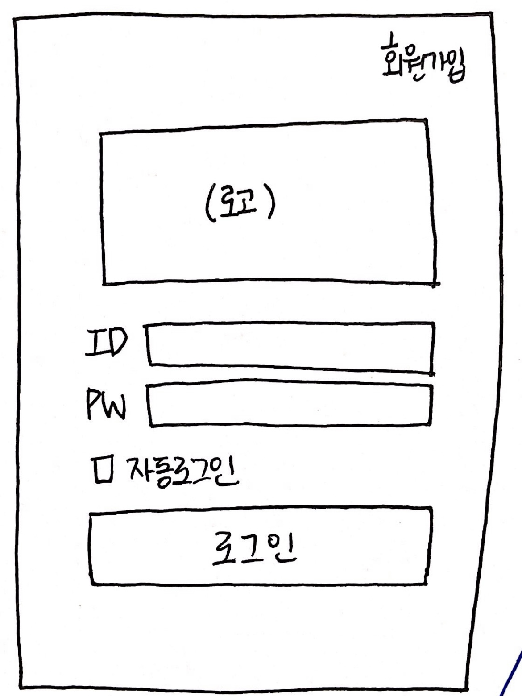
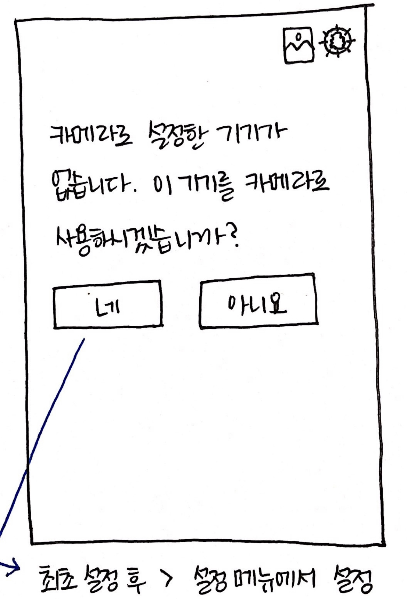
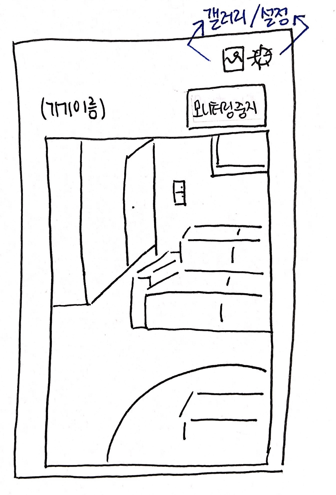
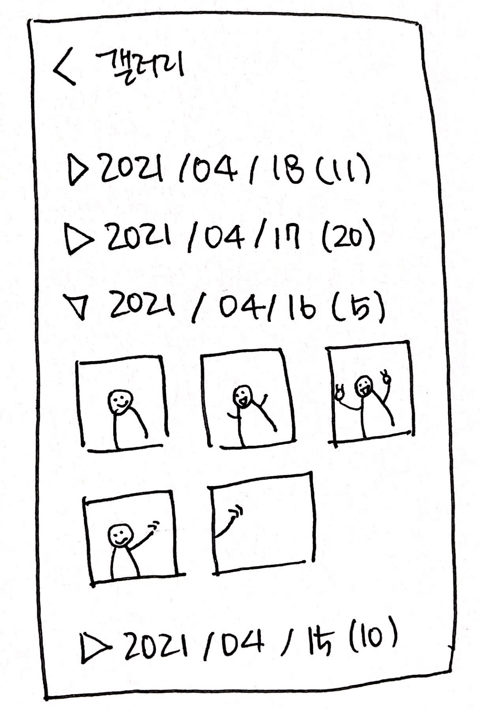
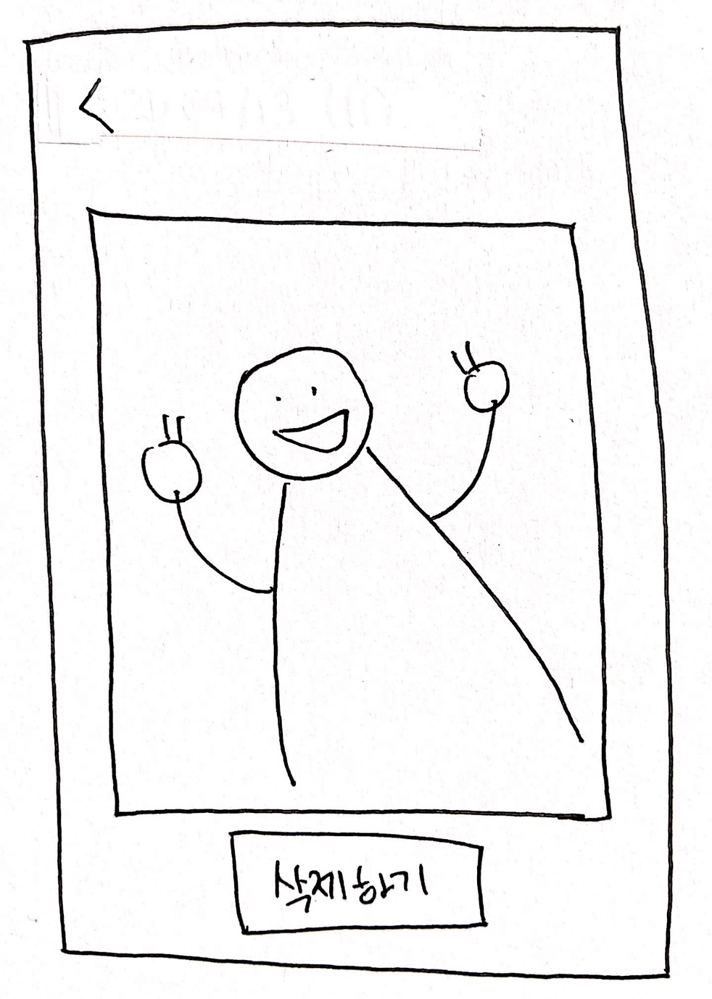
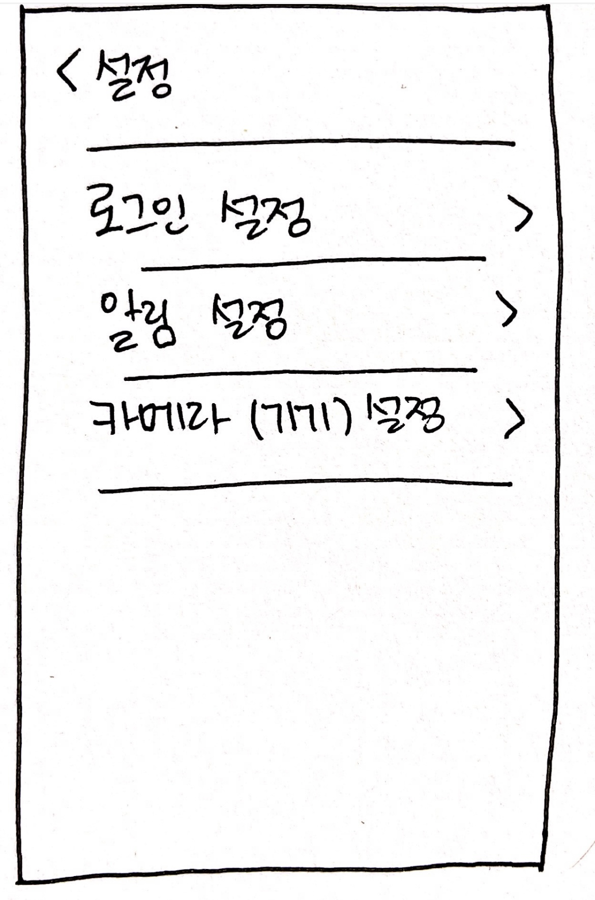
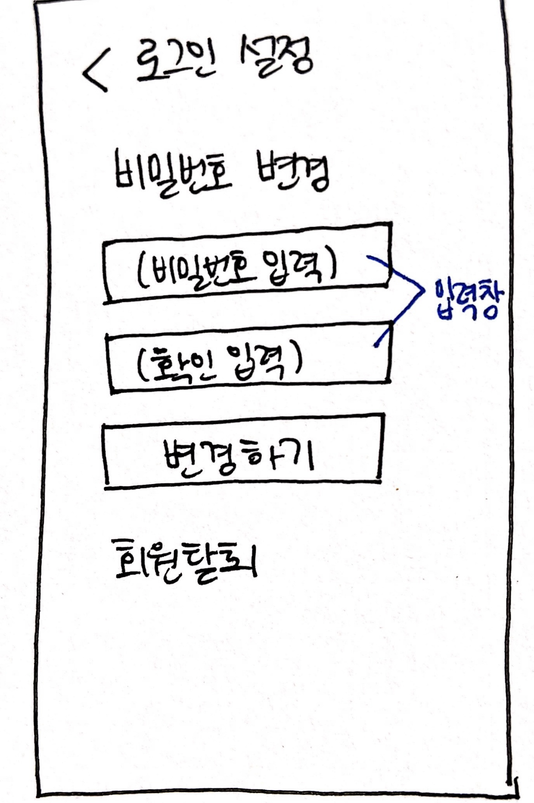
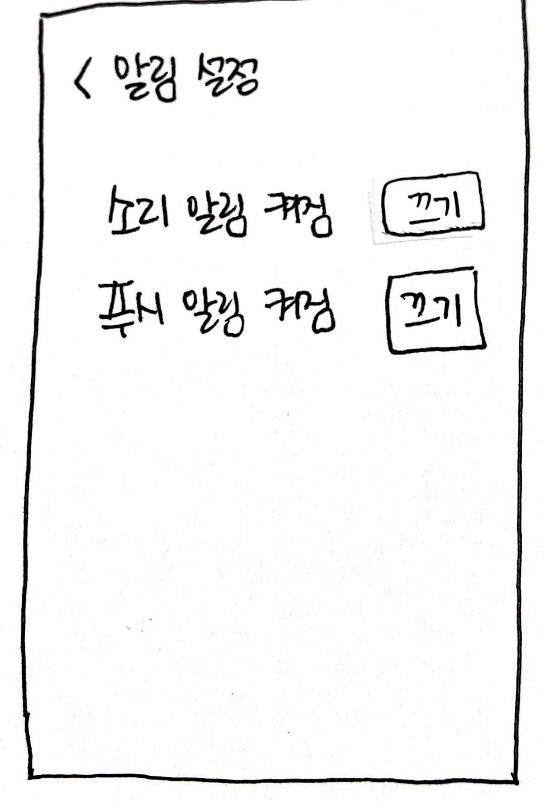
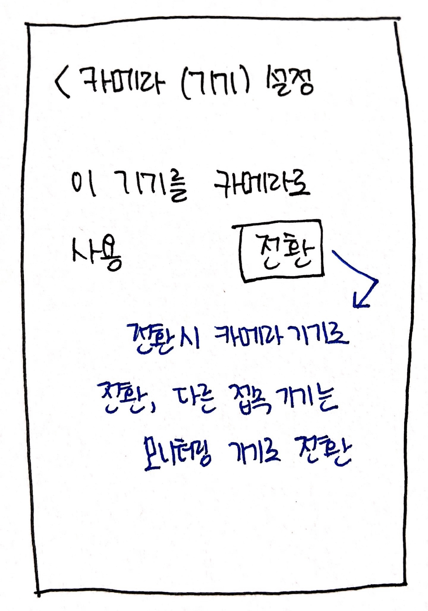
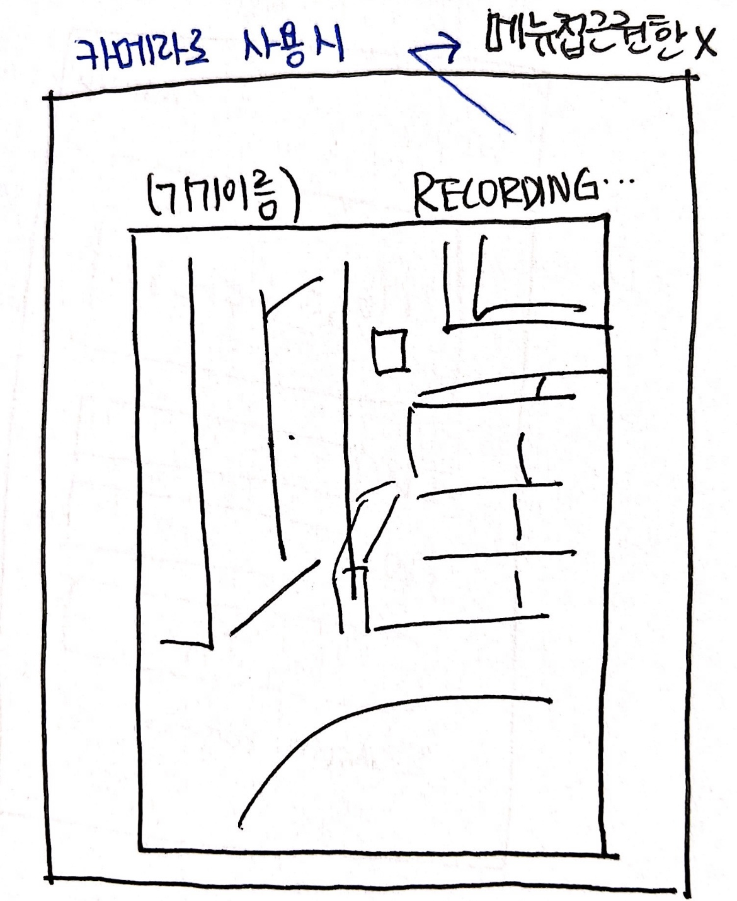

# Requirement

### Functional Requirement
Identifier | User Story | Size
:---------:|-----------|:----:
REQ-1 | 사용자로서, 나는 회원가입을 할 수 있다. | 1
REQ-2 | 사용자로서, 나는 아이디와 비밀번호를 입력하여 로그인 할 수 있다. | 1
REQ-3 | 사용자로서, 나는 카메라로 사용할 스마트 기기를 설정할 수 있다. | 4
REQ-4 | 사용자로서, 나는 비밀번호를 변경할 수 있다. | 1
REQ-5 | 사용자로서, 나는 카메라를 이용하여 모니터링을 시작할 수 있다. | 2
REQ-6 | 사용자로서, 나는 원격으로 모니터링을 종료할 수 있다. | 2
REQ-7 | 사용자로서, 나는 경보가 울리면 비밀번호를 입력하여 해제할 수 있다. | 2
REQ-8 | 사용자로서, 나는 모니터링 기록에 접근하고 삭제할 수 있다. | 3
REQ-9 | 인가되지 않은 사용자로서, 나는 모니터링 기록에 접근할 수 없다. | 1
REQ-10 | 인가되지 않은 사용자로서, 나는 모니터링을 강제로 끌 수 없다. | 1
REQ-11 | 기기는 카메라에 움직임이 감지되면 사진을 저장하고 사용자에게 알림을 전송한다. | 4
REQ-12 | 기기는 모니터링이 너무 오랜시간 지속되는 경우, 프로그램을 종료하고 사용자에게 알림을 전송한다. | 2
REQ-13 | 기기는 의도치 않게 카메라가 꺼진 경우 사용자에게 알림을 전송한다. | 1

### Non-Functional Requirement
Identifier | User Story | Size
:---------:|-----------|:----:
REQ-14 | 프로그램은 안정적으로 끊김없는 모니터링을 제공해야 한다. | 2
REQ-15 | 프로그램은 누구나 사용하기 쉬운 단순한 UI로 구성되어야 한다. | 1
REQ-16 | 카메라와 사용자 앱은 항상 연동되어 있어야 한다. | 3

### User Interface Requirement
Identifier | Priority Weight | Requirement
:---------:|----|:-----------:
REQ-17 | 10 | 프로그램은 회원가입, 로그인, 자동로그인이 가능해야 한다. 
REQ-18 | 4 | 프로그램은 로그인 후 카메라 설정 기기가 없을 시 카메라 설정이 가능해야 한다. 
REQ-19 | 10 | 프로그램은 카메라 설정 후 언제든지 모니터링 화면을 볼 수 있게 해야 한다. 프로그램은 갤러리 메뉴와 설정 메뉴를 제공해야 한다. 
REQ-20 | 10 | 프로그램은 갤러리 메뉴에서 저장된 사진을 열람 가능해야 한다. 
REQ-21 | 4 | 프로그램은 갤러리에 저장된 사진을 삭제할 수 있어야 한다. 
REQ-22 | 8 | 프로그램은 로그인 설정, 알림 설정, 카메라 설정 메뉴를 제공해야 한다. 
REQ-23 | 10 | 프로그램은 로그인 설정에서 비밀번호 변경, 회원 탈퇴가 가능해야 한다. 
REQ-24 | 4 | 프로그램은 알림을 끌 수 있어야한다.
REQ-25 | 10 | 프로그램은 모니터링 용으로 사용하던 기기를 카메라 용 기기로 전환할 수 있어야 한다. 
REQ-26 | 10 | 프로그램은 카메라 용으로 사용하는 기기가 갤러리, 설정 메뉴에 접근하는 것을 막아야 한다. 