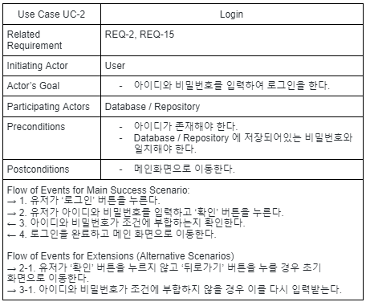
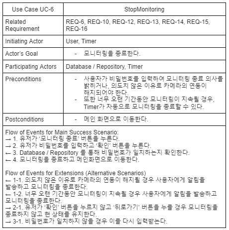
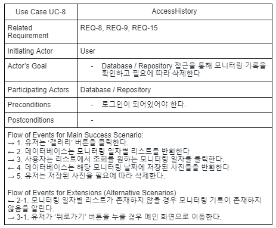
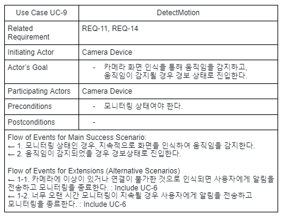

# Use Case

## Actors and Goals
Actor : User, Camera Device, Database / Repository, Timer

Actor | Actor's Goal | Use Case Name
:----:|--------------|:------------:
User | ‘회원가입’ 버튼을 눌러 회원가입하기 | UC-1: Register
User | 아이디와 비밀번호를 입력하여 로그인하기 | UC-2: Login
User | 카메라로 사용할 스마트 기기 설정하기 | UC-3: SetCamera
User | 설정에서 ‘비밀번호 변경’ 버튼을 눌러 비밀번호를 변경하기 | UC-4: ChangePassword
User | 모니터링을 가동하기 | UC-5: StartMonitoring
User | 모니터링을 종료하기 | UC-6: StopMonitoring
User | 비밀번호를 입력하여 경보 상태를 해제하기 | UC-7: StopAlarm
User | 모니터링 기록을 확인하거나 삭제하기 | UC-8: AccessHistory 
Camera Device | 카메라 화면 인식을 통해 움직임을 감지하고, 움직임이 감지되었을 때 경보 상태로 진입 | UC-9: DetectMotion
Camera Device | 경보 상태일때 사진을 촬영하고 사진 데이터 저장 | UC-10: TakePhoto
Camera Device | 경보 상태에 진입 시 사용자에게 알림 전송 | UC-11: SendAlert
Timer | 모니터링하는 시간을 측정하여 너무 오랜 시간동안 모니터링이 지속되는 경우에 모니터링을 자동으로 종료 | UC-6
Database / Repository | 사용자의 정보, 로그인 내역, 기기 정보 저장 | UC-12: SaveData

## Use Case - Fully Dressed Descriptions

  
 [ Fully Dressed Descriptions ] 

  

  
Use Case 1: Register

  
  

  

  
Use Case 2: Login

  
  

  

  
Use Case 3: SetCamera

  
  

  

  
Use Case 4: ChangePassword

  
  

  

  
Use Case 5: StartMonitoring

  
  

  

  
Use Case 6: StopMonitoring

  
  

  

  
Use Case 7: StopAlarm

  
  

  

  
Use Case 8: AccessHistory

  
  

  

  
Use Case 9: DetectMotion

  
  

  

  
Use Case 10: TakePhoto

  
  

  

  
Use Case 11: SendAlert

  
  

  

  
Use Case 12: SaveData

  
  

## Traceability Matrix

## Use Case Diagram
### Motion Detection

### Admin Subsystem

### History Management Subsystem

