### User Interface Mockups
# UI mockups for this program.

PageNum | UI Image | Explanation
:----:|---------|:-----------:
1 | 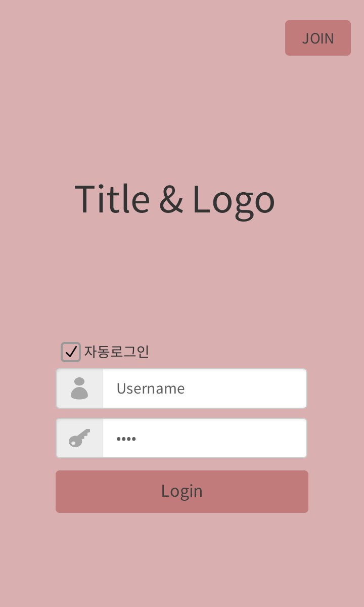 | 시작 화면. 로그인, 회원가입, 자동로그인 기능이 제공된다.
2 | 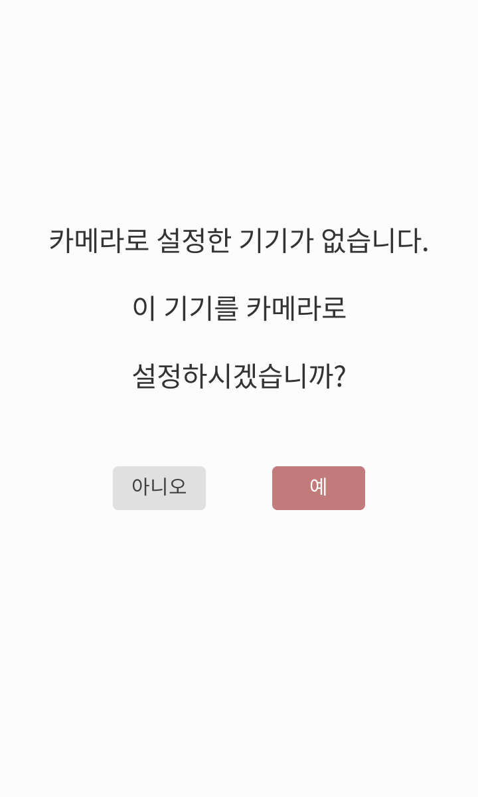 | 처음 사용 시에 나타나는 화면으로, 카메라 기기를 설정할 수 있다. 후에는 '설정' 탭에서 변경 가능하다.
3 | 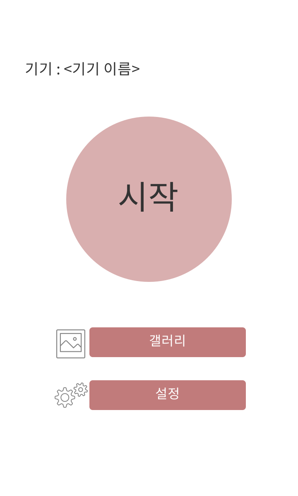 | 휴대용 핸드폰 기기 홈 화면. 시작을 누르면 모니터링을 시작한다.
4 | 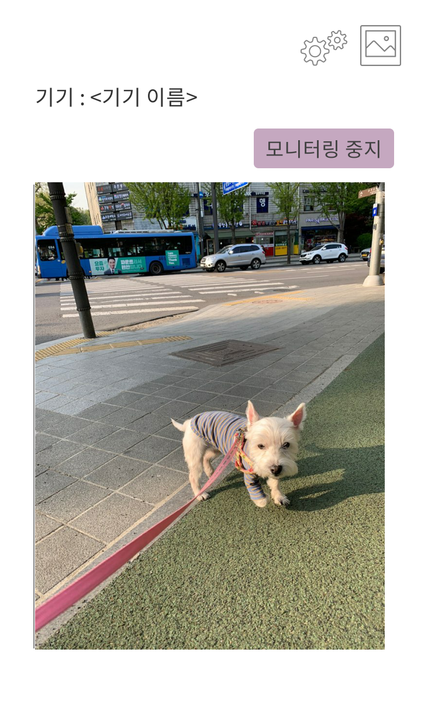 | 모니터링 중인 화면이다. 화면에는 카메라 기기로 촬영하고 있는 장면이 나온다. (현 화면은 임의의 사진을 집어넣은 것임) 모니터링 중지 버튼으로 모니터링을 멈출 수 있으며, 설정과 갤러리 버튼은 오른쪽 위로 옮겨졌다.
5 | 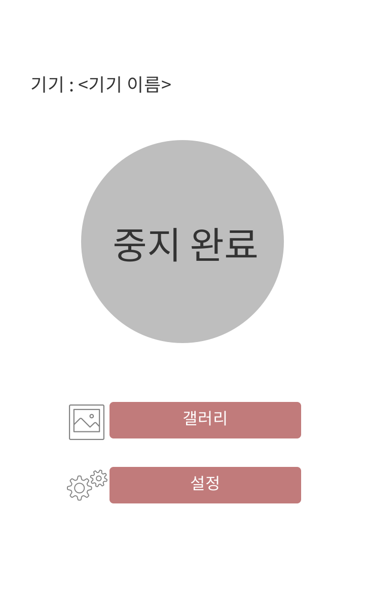 | 모니터링 중지 버튼을 누르면 나오는 잠시 나오는 화면으로, 바로 6번 화면으로 바뀐다. (가운데 원만 바뀌는 것)
6 |  | 
7 | 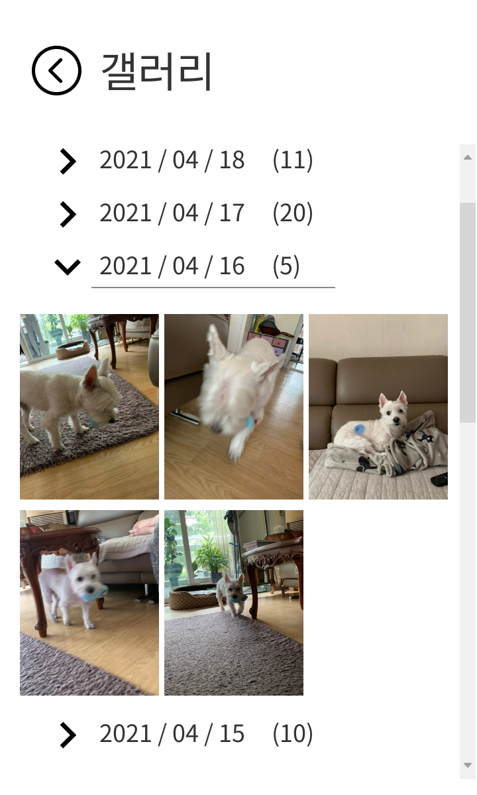 | 갤러리 탭을 누르면 나오는 화면. 왼쪽 상단의 화살표로 이전 화면으로 돌아갈 수 있으며, 날짜를 클릭하면 해당 날의 사진들을 볼 수 있다.
8 |  | 갤러리에서 사진을 고르면 해당 사진을 크게 볼 수 있으며, 사진을 삭제할 수 있다.
9 | 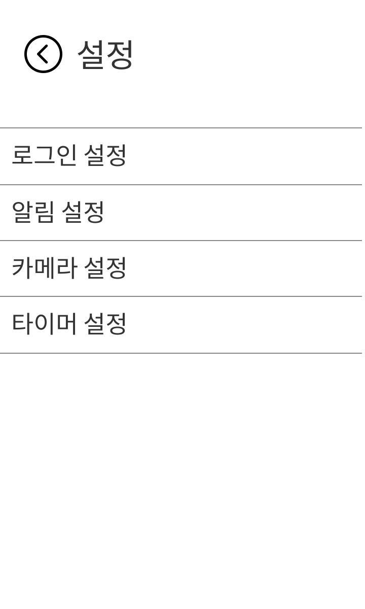 | 설정 탭을 누르면 나오는 화면. 
10 | 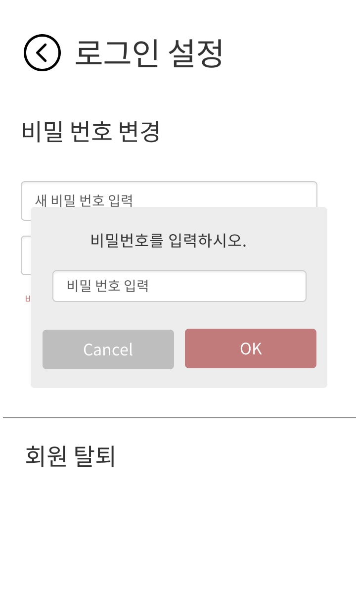 | 로그인 설정에 들어가려면 우선 비밀번호를 입력해야한다.
11 | 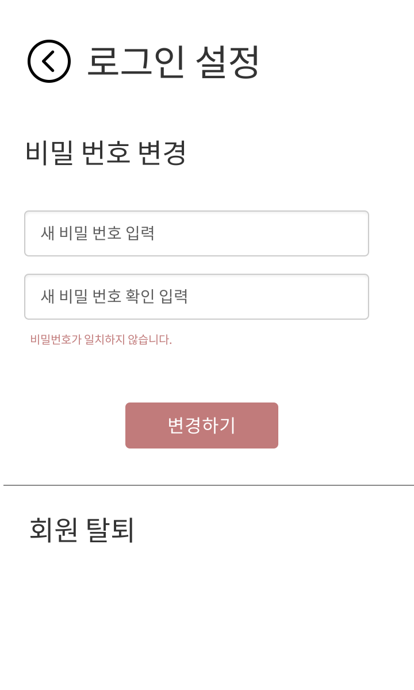 | 비밀번호 변경과 회원탈퇴 기능이 제공된다.
12 | 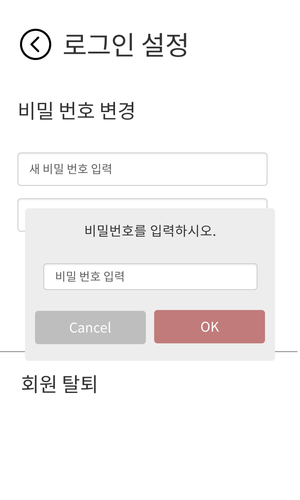 | 회원탈퇴를 누를 경우 다시 한 번 비밀번호를 입력해야한다.
13 | 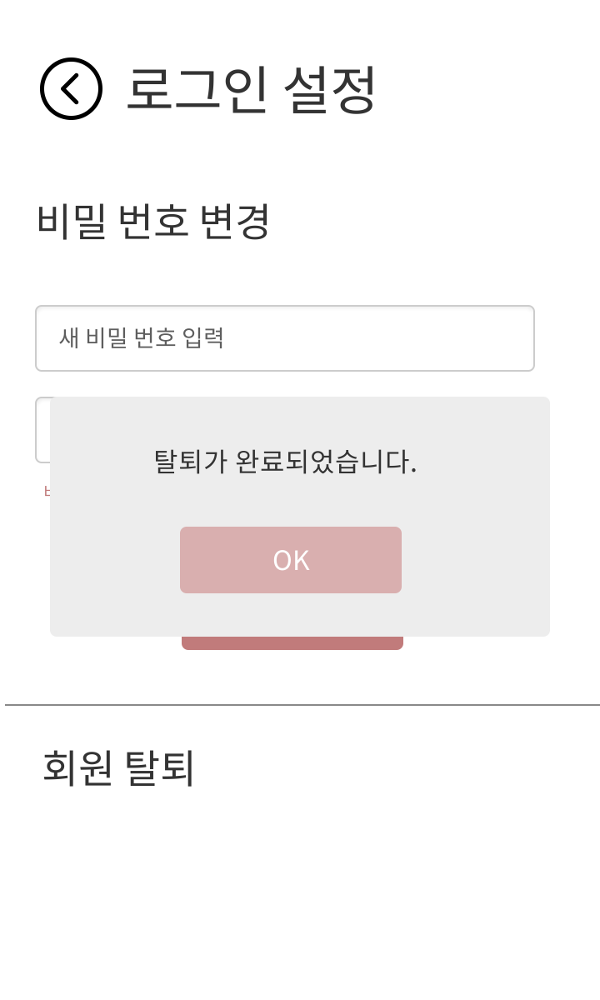 | 탈퇴 완료를 알려주는 토스트.
14 | 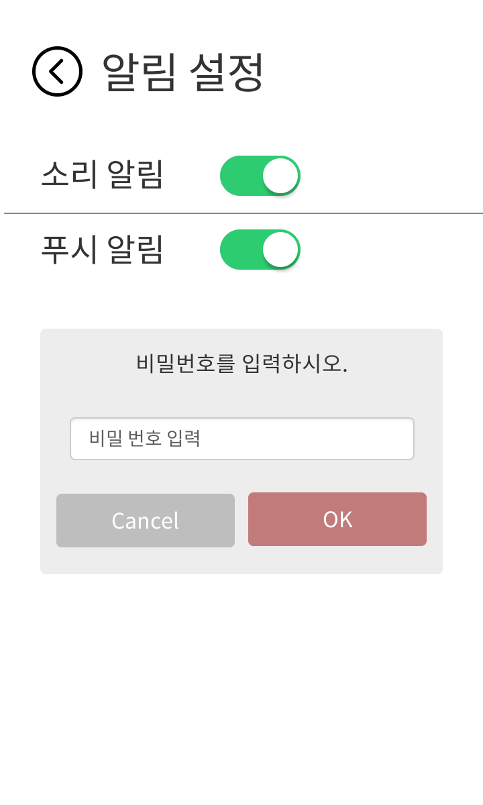 | 알림 설정 탭에 들어가려면 역시나 비밀번호를 다시 입력해야한다.
15 | 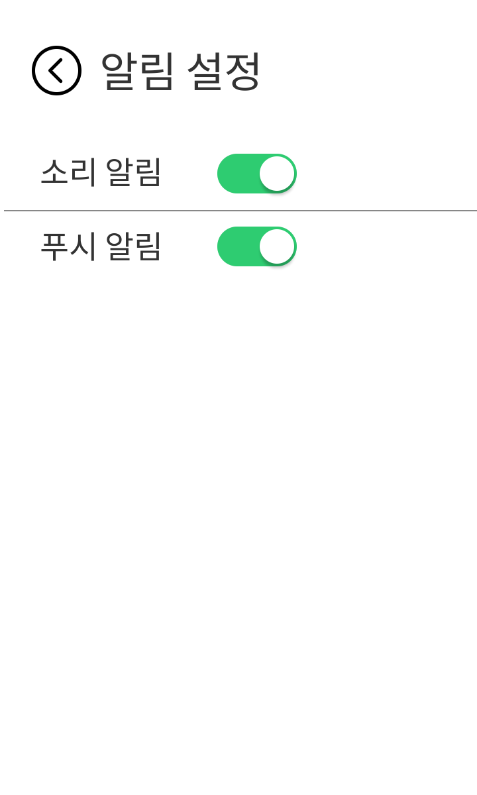 | 알림 설정은 on/off 스위치를 통해 설정 가능하다.
16 | 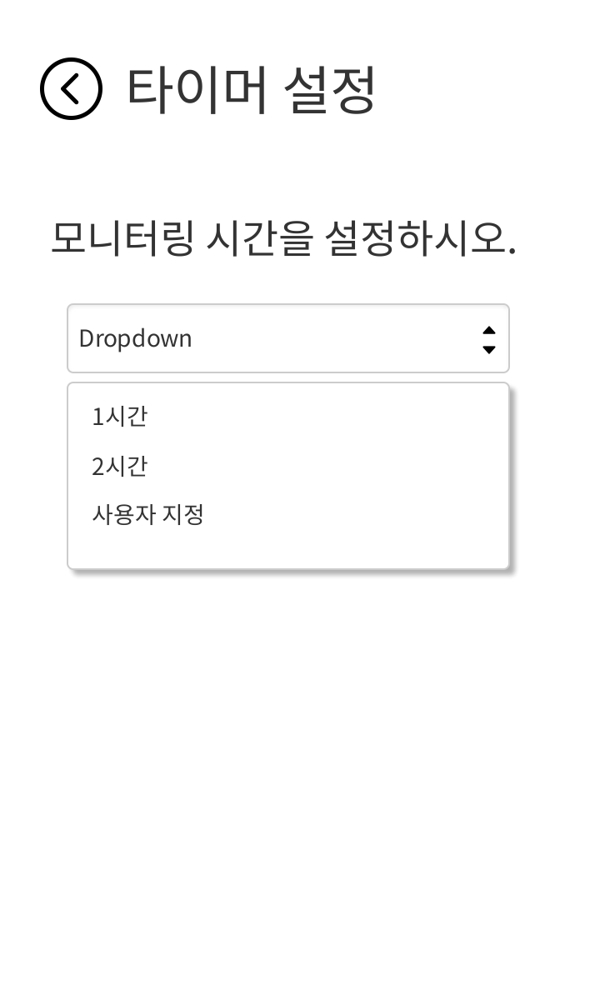 | 타이머 설정 페이지로, 드롭다운을 통해 모니터링 시간을 정할 수 있다. 설정한 모니터링 시간이 지나면, 모니터링은 자동으로 완료되며, 사용자에게 알림이 간다.
17 | 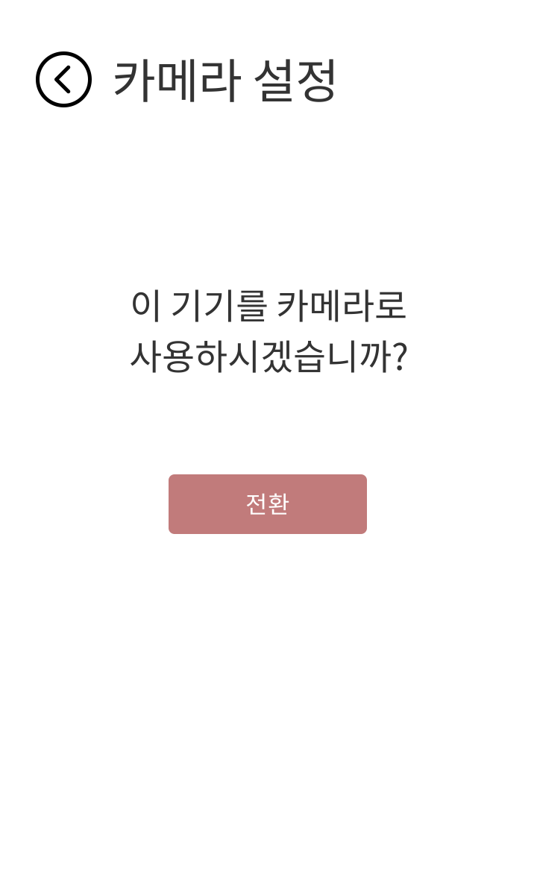 | 카메라 세팅을 변경할 수 있다. 
18 | 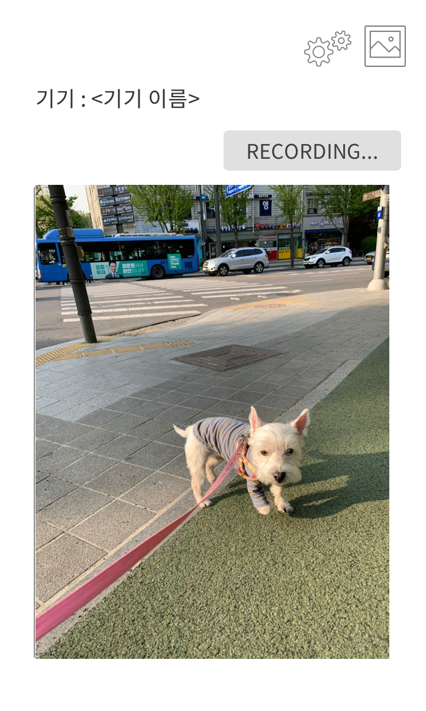 | 해당 키키를 카메라 기기로 변경할 경우 나타나는 홈 화면이다. 촬영용 기기에 있는 어플이므로, 촬영 이외의 기능 접근에는 제한을 둬야하기 때문에 모든 버튼을 없앴다.
